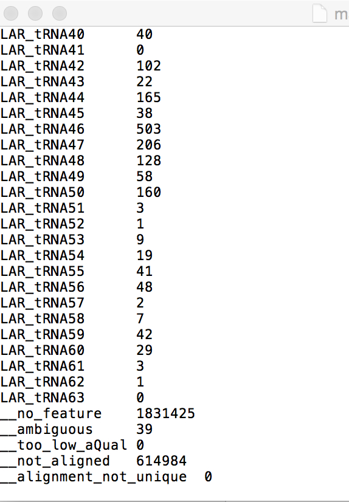

.. _dayfivemod:

Differential gene expression analysis with edgeR
================================================

Up to this point we have done several things: trimmed, QC'd, aligned, and counted reads that mapped to each gene. Now, we will finally move to the step where we will analyze the differential gene expression between the untreated and treated *L. reuteri* samples!

To do this, we have chosen to utilize an analysis package written in the R programming language called `edgeR <http://bioconductor.org/packages/release/bioc/vignettes/edgeR/inst/doc/edgeRUsersGuide.pdf>`_. edgeR stands for differential expression analysis of digital gene expression data in R. This is a fantastic tool that is actively maintained (as seen by the date of the most recent user guide update) and fairly easy to use. Several diagnostic plots are produced throughout the analysis that provide meaningful information as to whether we can even perform differential gene expression between samples and if there are batch effects we have to deal with.

RNA-seq data does not typically assume a normal (Gaussian) distribution, so to glean which genes are changing in a statistically significant manner, we have to model the data slightly differently. EdgeR implements what is called a `negative binomial distribution <http://en.wikipedia.org/wiki/Negative_binomial_distribution#Related_distributions>`_, sometimes referred to as a gamma-Poisson model. If you *really* enjoy statistics and would like to dig into the mathematical underpinnings of this software, see the references at the bottom of this page. If you are less interested in understanding the math behind all of this, here is the short summary: we need to examine the data to make sure they separate enough between treatments to determine differential gene expression and we *always* use a false-discovery rate correction to determine significance (even then, it's worth looking at the fold-change differences to decide if it is "real"; though this is slightly more arbitrary).

Let's get going!

We are going to do things in several steps today, with the goal being to be able to copy and paste as much of the code as we can.

#. :ref:`downloadedgeR`

#. :ref:`readindata`

#. :ref:`groupdata`

#. :ref:`filterdata`

#. :ref:`regroupandnormalize`

#. :ref:`mdsplot`

#. :ref:`diffexp`

#. :ref:`plotres`

.. _downloadedgeR:

Download and install edgeR
--------------------------

The first step is to open RStudio and download/install edgeR from the Bioconductor repository.

1. To install packages from Bioconductor, click next to the **>** cursor. Type **source("http://bioconductor.org/biocLite.R")** and hit Enter/Return.

.. image:: biocinstaller.jpg
	:align: center
	:alt: BiocLite installer

2. Then type **biocLite("edgeR")** and hit Enter/Return. RStudio should also install all the necessary dependencies as well.

.. note:: If RStudio asks "Update all/some/none? [a/s/n]:", type **a** and then hit Enter/Return to update **all** of the outdated packages. It's best to work with the most recent version of everything.

.. _readindata:

Read in the data to RStudio
---------------------------

The next step is to read in the data to RStudio.

1. We are going to download the data from the HPCC. Please download the map.sam files from the HTSeq directory to your desktop using FileZilla or WinSCP.

.. note:: We are going to need to edit each of these text files to remove the last five lines that will otherwise mess up the differential gene expression analysis.

1a. To do this, open the file in a text editor like TextEdit on Mac or Notepad on Windows.

1b. Scroll to the bottom of the file

1c. Remove the lines seen below in the screenshot.

1d. We also need to remove all the lines in the file that correspond to tRNA and rRNA.

1e. Teaching time: Didn't we remove all of the rRNA *before* we made the libraries for sequencing?! Guess we got most but not all...

.. note:: It is absolutely essential that we get rid of any line spaces at the bottom and between lines (e.g. after we get rid of the 16s rRNA lines). When you load it into Rstudio (next step), make sure you have exactly "1820 obs. of 1 variable". 

2. Now, we need to read the files into RStudio. To do this we need to create a variable for each file. I will give an example for each treatment that you should be able to copy and paste into RStudio.

**Mac users:**
	
	* **For LB control:** wt1 = read.table("~/Desktop/mapLRLB1.sam", row.names=1)

	* **For indole treated:** in1 = read.table("~/Desktop/mapLRindole1.sam", row.names=1)

	* **For E. coli commensal medium treated:** co1 = read.table("~/Desktop/mapLRcomm1.sam", row.names=1)

	* **For EHEC medium treated:** eh1 = read.table("~/Desktop/mapLRehec1.sam", row.names=1)
	
.. note:: Check to make sure you have "1820 obs. of 1 variable" by looking in the upper righthand corner of Rstudio (e.g. the Environment/Global Environment window).
	
**Windows users:**

	This is only slightly more complicated for you. It's the same idea and naming convention, but we are going to use the Tab autocomplete function to help us determine the file path to the Desktop.
	To do this we are going to break the steps down using the LB control as an example:
	
	#. Start typing in the command and place the cursor between the quotes so it looks like this (don't just copy and paste this in, type it out): wt1 = read.table("")
	
	#. Next, inside the quotes, type: /Users/ and then hit the Tab key once. This will present you with a list of potential paths forward. The one you want will usually resemble your user name for the account on your computer (typically the first or second one, NOT "All users"). Click on the one that resembles your user name.
	
	#. Your command should now look something like this: wt1 = read.table("/Users/yourusername/")
	
	#. Next, you can complete the file path and will look something like this: wt1 = read.table("/Users/yourusername/Desktop/mapLRLB1.sam")
	
	#. Finally, we can complete the command: wt1 = read.table("/Users/yourusername/Desktop/mapLRLB1.sam", row.names=1)
	
.. note:: Check to make sure you have "1820 obs. of 1 variable" by looking in the upper righthand corner of Rstudio (e.g. the Environment/Global Environment window).

3. Repeat each of these commands for the respective treatment, making sure to change the variable name (e.g. wt1, in1, co1, eh1) each time (e.g. wt2 for LRWT2map.sam).

4. Now we need to rename the sample column names. To do this, I will give an example for each treatment that you should be able to copy and paste into RStudio.

	* **For LB control:** colnames(wt1) <- 'wt1'

	* **For indole treated:** colnames(in1) <- 'in1'

	* **For E. coli commensal medium treated:** colnames(co1) <- 'co1'

	* **For EHEC medium treated:** colnames(eh1) <- 'eh1'

5. Repeat each of these commands for the respective treatment, making sure to change the variable name (e.g. wt1, in1, co1, eh1) each time (e.g. wt2 for LRWT2map.sam) and the new name (e.g. wt2).

.. _groupdata:

Group the data together
-----------------------

So that we don't have to work on each sample individually, we will put them all into a single variable.

.. note:: It is important that you put all of the same treatment type together in consecutive order (e.g. 1-7).

.. note:: It is important that you put the control treatment (LB) as the first set of samples for our purposes. Otherwise, it's simply important that you know what are your controls and treatments.

1. To do this, copy and paste one of the following depending on which treatments you are comparing.

	* **For LB vs Indole:** wtvin <- cbind(wt1, wt2, wt3, wt4, in1, in2, in3, in4, in5, in6)
	
	* **For LB vs Commensal conditioned medium:** wtvco <- cbind(wt1, wt2, wt3, wt4, co1, co2, co3, co4, co5, co6, co7)
	
	* **For LB vs EHEC conditioned medium:** wtveh <- cbind(wt1, wt2, wt3, wt4, eh1, eh2, eh3, eh4, eh5, eh6, eh7)
	
2. After you've copy and pasted this in, hit Enter/Return.

3. Now, let's group them by factor. Copy and paste the appropriate command based on what you are comparing.

	* **For LB vs Indole:** group <- factor(c(1,1,1,1,2,2,2,2,2,2))
	
	* **For LB vs Commensal conditioned medium:** group <- factor(c(1,1,1,1,2,2,2,2,2,2,2))
	
	* **For LB vs EHEC conditioned medium:** group <- factor(c(1,1,1,1,2,2,2,2,2,2,2))
	
.. note:: This step simply allows us to separate each treatment from each other (i.e. control vs. treatment).

.. _filterdata:

Filter out low counts
---------------------

It is important to filter out genes that have low read counts associated with them. This is because they will ultimately lead to a skewing of the data in subsequent steps of the analysis.

1. We will generate an edgeR data structure called a DGEList. This will create the scaffold with which edgeR can access the data and do differential gene expression. Copy and paste the appropriate command for what you are comparing and then hit Enter/Return.

	* **For LB vs Indole:** y <- DGEList(counts=wtvin, group=group)
	
	* **For LB vs Commensal conditioned medium:** y <- DGEList(counts=wtvco, group=group)
	
	* **For LB vs EHEC conditioned medium:** y <- DGEList(counts=wtveh, group=group)
	
2. Now we will filter out genes that have counts greater than 2 CPM (counts per million reads mapped) in at least four samples.

	* **Type:** keep <- rowSums(cpm(y)>2) >= 4
	
.. note:: We may come back and refine this number when we have a look at our final scatter plot of the data.

3. We will apply this filter we just made to our data set.

	* **Type:** y <- y[keep,]

.. _regroupandnormalize:

Regroup and normalize the libraries
-----------------------------------

For this next set of steps, we will regroup our data now that we have applied this filter and normalize everything based on effective library size to prevent sequencing depth and library size from skewing the data.

1. To regroup the data:

	* **Type:** y$samples$lib.size <- colSums(y$counts)
	
2. Now let's normalize the data:

	* **Type:** y <- calcNormFactors(y)
	
3. We can view what the scaling factor is by typing:

	* **Type:** y$samples

.. _mdsplot:

See how samples separate by treatment
-------------------------------------

This is a *very* critical step. The results of this plot will let us know if we can proceed with differential gene expression. It will tell us whether our controls are separate enough from the treatment and if we have to deal with a batch effect.

Building the plot is easy at this point:

	* **Type:** plotMDS(y)

.. _diffexp:

Differential expression calculations
------------------------------------

Now, assuming everything has passed the MDS plot. Let's move on to the differentially expressed genes.

1. Let's estimate the dispersion (variance):

	* **Type:** y <- estimateCommonDisp(y, verbose=TRUE)

	* **Type:** y <- estimateTagwiseDisp(y)
	
.. note:: An average BCV (biological coefficient of variation) for isogenic organisms in a lab setting (like what we are doing here) should be about 10-15%
	
2. We can plot the dispersion:

	* **Type:** plotBCV(y)
	
.. note:: The results of this plot will give us an idea about the variances across all genes that are lowly expressed all the way to highly expressed. Normally, the more lowly expressed genes will have larger variation compared to the more highly expressed genes.

3. Now we can do the actual differential gene expression statistical test. In this case, we are going to use the exact test:

	* **Type:** res <- exactTest(y)
	
4. To perform the FDR (false discovery rate) p-value correction:

	* **Type:** fdr <- p.adjust(res$table$PValue, method="BH")

5. To extend our observations and compare consistency across samples within treatment, let's grab the CPM values per gene:

	* **Type:** cpmres <- cpm(y)[rownames(res),]
	
6. To quickly view how many genes are moving up and down:

	* **Type:** summary(de <- decideTestsDGE(res))
	
7. Let's export everything to the desktop:

	* **Type:** write.csv(cpmres, file='~/Desktop/cpmresults.csv')

	* **Type:** write.csv(res$table, file='~/Desktop/DEresults.csv')

	* **Type:** write.csv(fdr, file='~/Desktop/fdrcorrection.csv')
	
.. note:: Change the 'cpmresults.csv' file name to something more meaningful related to your sample comparison.

.. note:: Change the 'DEresults.csv' file name to something more meaningful related to your sample comparison.

.. note:: Change the 'fdrcorrection.csv' file name to something more meaningful related to your sample comparison.

.. _plotres:

Plot the results
----------------

Finally, let's look at a scatter plot where the red dots correspond to differentially expressed genes. The blue lines will indicate two-fold differential expression.

To generate the plot:

	* **Type:** detags <- rownames(y)[as.logical(de)]
	* **Type:** plotSmear(res, de.tags=detags)
	* **Type:** abline(h=c(-1,1), col='blue')
	
Now marvel at your beautiful plot! Show your neighbor and be proud, you've navigated RNA-seq analysis successfully!

**The final steps will be to take the three files you exported and put them together into a single Excel file, filter for genes with an adjusted p-value(FDR) < 0.05, and then filter genes that have two-fold differential expression (the logFC stands for logFoldChange, where it is log base 2; up two-fold is logFC=1, down two-fold is logFC=-1).**

