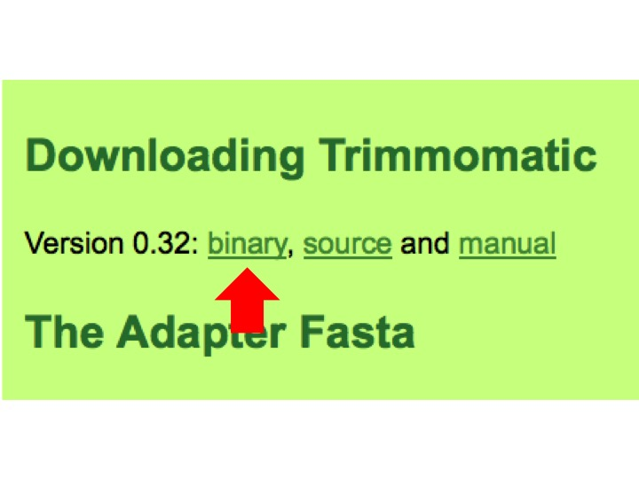

.. _dayone:

Install software and make sure everyone is on the same page
===========================================================

Before moving forward to mapping reads to the genome, it is necessary to QC the reads and remove low quality reads and adapter sequences. Further we need the ability to perform differential gene expression between conditions. We have chosen to do this through several software packages. Below are some instructions on how to install them.

Software to install:
--------------------

#. :ref:`trimmomatic`

#. :ref:`fastqc`

#. :ref:`r`

#. :ref:`rstudio`

.. _trimmomatic:

Trimmomatic
-----------

Trimmomatic is a commonly utilized tool for QC/trimming short reads and has been implemented in RNA-seq approaches in the literature and is the go to tool at the MSU sequencing facility (RTSF).

1. Trimmomatic can be downloaded from `here <http://www.usadellab.org/cms/index.php?page=trimmomatic>`_.

2. Scroll down the page (which you can read at your leisure later if you are interested) to where it says "Download Trimmomatic"

3. Click on the link that says "binary"

	
4. The file will end up in your downloads folder and will likely need to be unzipped as it is compressed. This can typically be accomplished just by double clicking on the file itself in your downloads folder.

5. Once this is done, move the folder to your desktop.

.. note:: Trimmomatic runs on Java. Go `here <http://www.java.com/en/>`_ and click on "Download" and download the latest version of Java for your computer. **Trimmomatic will not run unless you have Java installed**.

6. Open the Trimmomatic folder on your desktop and navigate to the folder called **adapters**.

7. Drag and drop the file **TruSeq3-SE.fa** out of the adapters subfolder and into the main **Trimmomatic** folder. The list of files in the main folder will like be: an adapters folder, LICENSE, trimmomatic-0.32.jar, and TruSeq3-SE.fa.

8. You should be all set for installing this software!

.. _fastqc:

FastQC
------

Text

.. _r:

R
-

Text

.. _rstudio:

RStudio
-------

Text