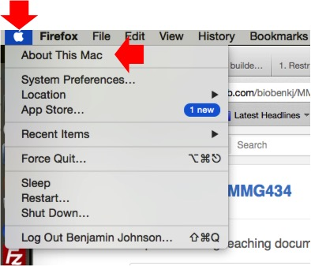
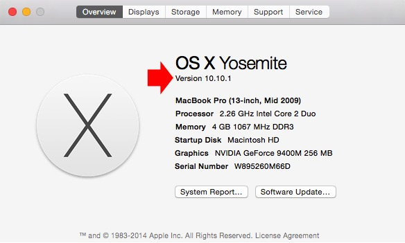
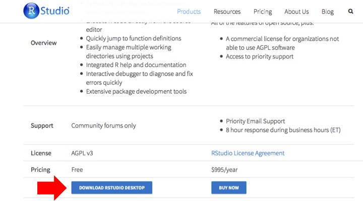

.. _dayone:

Install software and make sure everyone is on the same page
===========================================================

Before moving forward to mapping reads to the genome, it is necessary to QC the reads and remove low quality reads and adapter sequences. Further we need the ability to perform differential gene expression between conditions. We have chosen to do this through several software packages. Below are some instructions on how to install them.

Software to install:
--------------------

#. :ref:`trimmomatic`

#. :ref:`fastqc`

#. :ref:`r`

#. :ref:`rstudio`

.. _trimmomatic:

Trimmomatic
-----------

Trimmomatic is a commonly utilized tool for QC/trimming short reads and has been implemented in RNA-seq approaches in the literature and is the go to tool at the MSU sequencing facility (RTSF).

1. Trimmomatic can be downloaded from `here <http://www.usadellab.org/cms/index.php?page=trimmomatic>`_.

2. Scroll down the page (which you can read at your leisure later if you are interested) to where it says "Download Trimmomatic"

3. Click on the link that says "binary"

.. image:: trimbinary.jpg
	:width: 400px
	:align: center
	:height: 300px
	:alt: image showing area where to download the binary file for Trimmomatic
	
4. The file will end up in your downloads folder and will likely need to be unzipped as it is compressed. This can typically be accomplished just by double clicking on the file itself in your downloads folder.

5. Once this is done, move the folder to your desktop.

.. note:: Trimmomatic runs on Java. Go `here <http://www.java.com/en/>`_ and click on "Download" and download/install the latest version of Java for your computer. **Trimmomatic will not run unless you have Java installed**.

6. Open the Trimmomatic folder on your desktop and navigate to the folder called **adapters**.

7. Drag and drop the file **TruSeq3-SE.fa** out of the adapters subfolder and into the main **Trimmomatic** folder. The list of files in the main folder will like be: an adapters folder, LICENSE, trimmomatic-0.32.jar, and TruSeq3-SE.fa.

8. You should be all set for installing this software!

.. _fastqc:

FastQC
------

FastQC is an application that can be utilized to assess sequence data. It's worth looking at the reads after trimming/before aligning to the genome and after aligning to the genome.

1. FastQC can be downloaded `here <http://www.bioinformatics.babraham.ac.uk/projects/fastqc/>`_.

.. image:: fastqc.jpg
	:align: center
	:alt: image showing area where to download FastQC
	
.. image:: fastqcfiledownload.jpg
	:align: center
	:alt: image showing area where to download either Windows or Mac FastQC files

2. The software is well documented and quite powerful. Every statistic/assessment that it draws can be found in the `FastQC documentation <http://www.bioinformatics.babraham.ac.uk/projects/fastqc/Help/>`_. Further, you can watch a `tutorial video <https://www.youtube.com/watch?v=bz93ReOv87Y>`_ and view examples of `good Illumina data <http://www.bioinformatics.babraham.ac.uk/projects/fastqc/good_sequence_short_fastqc.html>`_ and `bad Illumina data <http://www.bioinformatics.babraham.ac.uk/projects/fastqc/bad_sequence_fastqc.html>`_.

3. The file will end up in your downloads folder. If you are a **Windows user**, double click on the **run_fastqc bat file**. If you are a **Mac** user, double click on the **fastqc_vX.XX.X.dmg file** to run the application.

.. note:: FastQC runs on Java. Go `here <http://www.java.com/en/>`_ and click on "Download" and download/install the latest version of Java for your computer. **FastQC will not run unless you have Java installed**.

4. Please attempt to open the software to make sure that everything will at least open and run.

5. Congratulations! You've installed another piece of software for this module.

.. _r:

R
-

In order to do differential gene expression to compare treatments and identify what is changing at the transcript level, we need to install the statistical programming language R and a really neat interface to work in R called RStudio.

1. R can be downloaded from `here <http://cran.mtu.edu/>`_.

2. Click on the appropriate link for your operating system (Linux, Mac OS X, or Windows).

.. image:: Rplatformselection.jpg
	:align: center
	:alt: image showing the list of platforms that R can be downloaded/installed for

3. Then, click on the latest version of the software. This will initiate the download. **Windows users** unless you know you already have R installed, click on the **install R for the first time** link (see below). **Mac users** you have two options based on what flavor of OS X you have. If you are not sure what version you have, look at the screen shots below. 

**Windows users:**

.. image:: RforWindows.jpg
	:align: center
	:alt: R for Windows
	
**Mac users (to determine OS X version):**

	

	
**Mac users (version of R to download):**

.. image:: RforMac.jpg
	:align: center
	:alt: R for Mac based on OS X version
	
4. After the download finishes, double-click on the file and follow the instructions to install the software.

5. Congratulations! You've installed yet another piece of software for this module.

.. _rstudio:

RStudio
-------

RStudio is a fantastic interface to work in R. R does have a graphical user interface (GUI) that you can download and use, however I find RStudio much more intuitive/easier to use.

1. RStudio can be downloaded `here <http://www.rstudio.com/products/RStudio/#Desk>`_.

2. We want to download and install the open-source version of RStudio for the desktop.

	
3. Double click the file after the software has finished downloading and follow the instructions to install the software.

4. That's it! You're done!