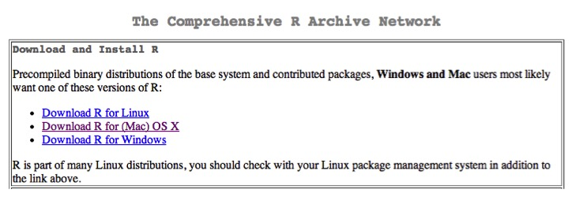
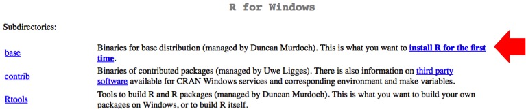
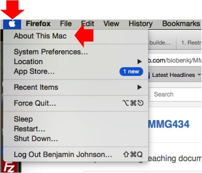
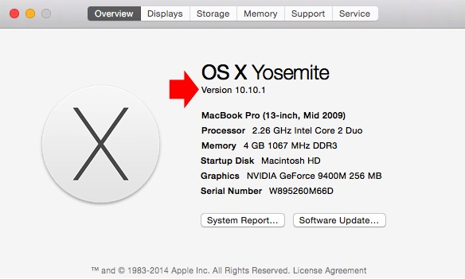
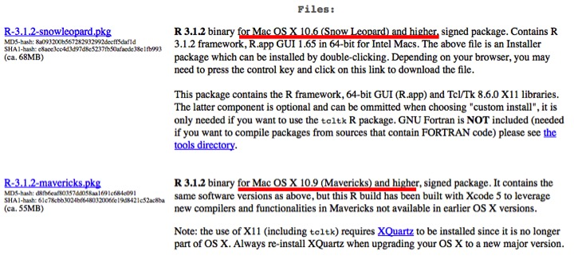
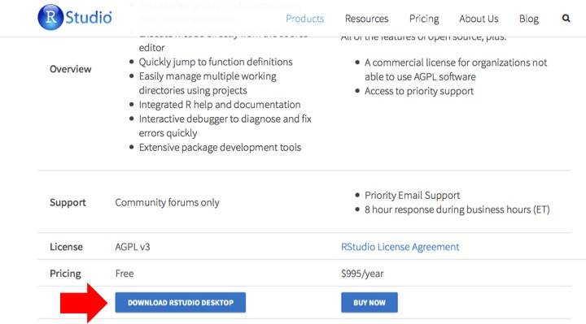
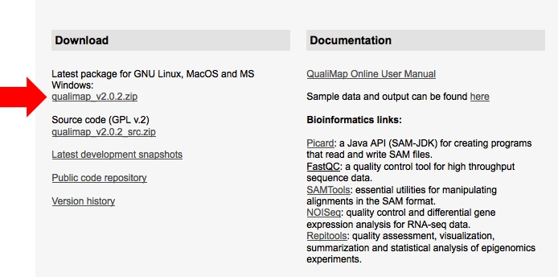
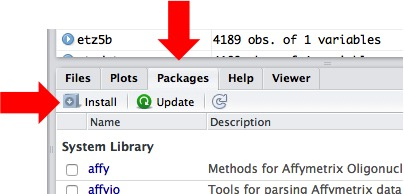
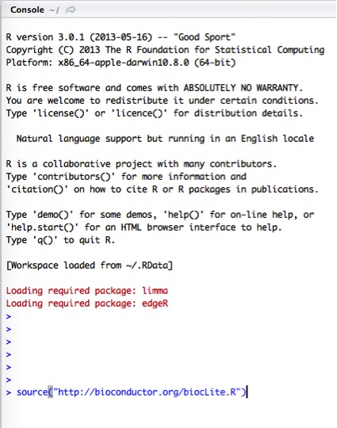

.. _dayonemod:

Install software and using FileZilla to transfer files
======================================================

Before moving forward to mapping reads to the genome, it is necessary to QC the reads and remove low quality reads and adapter sequences. Since most of you are familiar with Trimmomatic and FastQC on the HPCC from MMG 433, we will do all the analysis there instead of on your own local machine. Further we need the ability to perform differential gene expression between conditions. We have chosen to do this through several software packages. Below are some instructions on how to install them.

Software to install:
--------------------

#. :ref:`r`

#. :ref:`rstudio`

#. :ref:`qualimap`

Using FileZilla to transfer files:
----------------------------------

#. :ref:`fz`

.. _r:

R
-

In order to do differential gene expression to compare treatments and identify what is changing at the transcript level, we need to install the statistical programming language R and a really neat interface to work in R called RStudio.

1. R can be downloaded from `here <http://cran.mtu.edu/>`_.

2. Click on the appropriate link for your operating system (Linux, Mac OS X, or Windows).

3. Then, click on the latest version of the software. This will initiate the download. **Windows users** unless you know you already have R installed, click on the **install R for the first time** link (see below). **Mac users** you have two options based on what flavor of OS X you have. If you are not sure what version you have, look at the screen shots below. 

**Windows users:**

	
**Mac users (to determine OS X version):**

	

	
**Mac users (version of R to download):**

	
4. After the download finishes, double-click on the file and follow the instructions to install the software.

5. Congratulations! You've installed yet another piece of software for this module.

.. _rstudio:

RStudio
-------

RStudio is a fantastic interface to work in R. R does have a graphical user interface (GUI) that you can download and use, however I find RStudio much more intuitive/easier to use.

1. RStudio can be downloaded `here <http://www.rstudio.com/products/RStudio/#Desk>`_.

2. We want to download and install the open-source version of RStudio for the desktop.

	
3. Double click the file after the software has finished downloading and follow the instructions to install the software.

4. That's it!

.. _qualimap:

Qualimap
--------

The last piece of software that is nice to have is a software suite that works with Java and R to generate PDF documents summarizing the data post-alignment to the genome.

1. Qualimap can be downloaded `here <http://qualimap.bioinfo.cipf.es/>`_.

2. Click on the .zip file (as seen below)

	
3. The file will end up in your downloads folder and will likely need to be unzipped as it is compressed. This can typically be accomplished just by double clicking on the file itself in your downloads folder.

4. Once this is done, move the folder to your desktop.

5. Before we can run this software suite, we will need to install a few packages in R: optparse (from CRAN), NOISeq, Repitools, Rsamtools, GenomicFeatures, rtracklayer (all available from Bioconductor).

6. To do this, open RStudio, and click on the **packages** tab and then the **Install** button.

	
7. Type **optparse** into the **Packages (separate multiple with space or comma):** field. Then click **Install**. RStudio should do the rest.

8. To install the packages from Bioconductor, click next to the **>** cursor. Type **source("http://bioconductor.org/biocLite.R")** and hit Enter/Return.

9. Then type **biocLite("NOISeq")** and hit Enter/Return. Repeat for Repitools, Rsamtools, GenomicFeatures, and rtracklayer.

10. That's all the software we need to install for now!

.. _fz:

Transferring files from your machine to the HPCC using FileZilla
----------------------------------------------------------------

**1.** If you haven't already downloaded and installed `FileZilla <https://filezilla-project.org/>`_, please do so. We want to download the **FileZilla Client** and *not* the server version.

**2.** Open the application and then we will need to input a few things to get connected to the MSU HPCC. 

	* Host: hpcc.msu.edu
	* Username: Your MSU NetID
	* Password: Your MSU NetID password
	* Port: 22
	* Click **Quickconnect**
	
**3.** Now that you are connected, you can move files from your computer (red circle) to the MSU HPCC (green circle) and vice versa, simply by double clicking the file. The connection closes if you exit out of the application.

.. image:: filezillaclient.jpg
	:align: center
	:alt: Transfer files from local host to HPCC with FileZilla
	
**Let's get to work!**