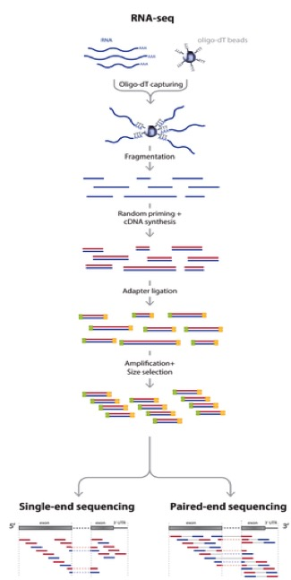
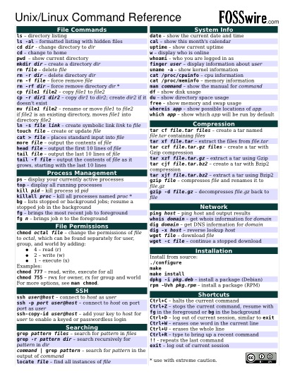
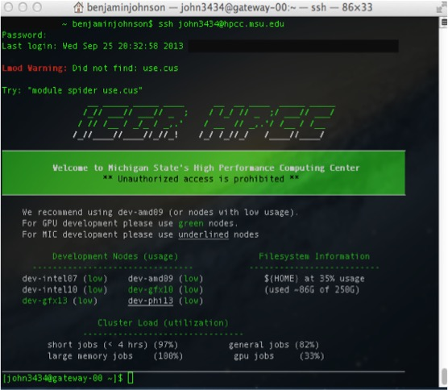
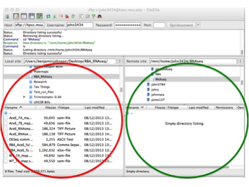

.. _daytwo:

RNA-seq background information, basic Linux/Unix commands, and Bowtie primer
============================================================================

Before we really dig into the data and begin trimming and aligning the reads to the genome, I think it is useful to understand what happens *after you submit your RNA to the sequencing facility*. This sort of knowledge can be very useful in understanding what could potentially provide bias and any number of issues to the end dataset. In this session we will cover several things including: 

#. :ref:`rnaseqbackground`

#. :ref:`basic-unix-coms`

#. :ref:`logintohpcc`

#. :ref:`bowtieprimer`

.. _rnaseqbackground:

RNA-seq background information
------------------------------

Before we begin, let's watch a video about how `Illumina sequencing works <https://www.youtube.com/watch?v=womKfikWlxM>`_.

This video does a pretty good job explaining how, in generalities the sequencing process works for DNA. So for sequencing RNA, the process is as follows:

	
*Adapted from: Zhernakova et al., PLoS Genetics 2013*

So actually, we aren't sequencing RNA at all! We are sequencing the cDNA made from the RNA. But now, let's talk about what can add bias to the data and what we do with the data to make sure that it is reasonable to proceed to further analysis steps.

.. _basic-unix-coms:

Basic Linux/Unix commands
-------------------------

To refresh your memory on some basic Linux/Unix commands, we will cover the basic commands necessary to:

**1.** Move through folders

**2.** List the contents of a folder

**3.** Make new folders

**4.** Rename files/folders

**5.** Delete files/folders

**6.** Load modules on the MSU HPCC

.. csv-table::
   :header: " ", "Command", "What it does...", "Examples"
   :widths: 2, 8, 10, 40

   "**1.**", "cd", "Change directory/folder", "**>** cd ~ (this changes to your home directory); **>** cd .. (this goes back one folder)"
   "**2.**", "ls", "List the contents of a folder", "**>** ls"
   "**3.**", "mkdir", "Make a new directory/folder", "**>** mkdir NewFolder (this will make a new folder called 'NewFolder' in your current directory)"
   "**4.**", "mv", "Rename or move a file from one name to another", "**>** mv file1 file2 (this will rename/move file1 to file2)"  
   "**5.**", "rm", "Remove a file (add the -r flag to remove a folder)", "**>** rm file1 (remove file1); **>** rm -r folder1 (remove folder1)" 
   "**6.**", "module load", "Load a module on the MSU HPCC", "**>** module load Bowtie (loads the most recent version of Bowtie on the HPCC)"

**Command reference sheet**

	
*Ref. sheet from: http://files.fosswire.com/2007/08/fwunixref.pdf*

.. _logintohpcc:

Logging into and transferring files to the MSU HPCC
---------------------------------------------------

There are multiple ways with which you can access the HPCC and transfer files to the iCER machines. This overview will be from a GUI standpoint. If you would like to get fancy and learn the Linux/Unix commands, you can access the examples on the HPCC wiki `here <https://wiki.hpcc.msu.edu/display/hpccdocs/Transferring+Files+to+the+HPCC>`_. Any other questions you may have not detailed here (which is a lot...) on how to use the HPCC more effectively, you can check out the user manual `here <https://wiki.hpcc.msu.edu/display/hpccdocs/HPCC+Basics>`_. There are even videos of examples on how to use various software packages.

**Mac users:**

**1.** Open the terminal by going to Finder -> Applications -> Utilities -> Terminal (might just be worth dragging it onto your dock).

.. image:: mactermnav.jpg
	:align: center
	:alt: Navigate to terminal on a Mac

**2.** Type: **ssh YourMSUNetID@hpcc.msu.edu**

**3.** You will then be prompted for your MSU NetID password. As you begin to type, the cursor will not show that you are entering characters, but you are. Hit the Enter/Return key at the end and you will be logged in. If this is the first time accessing the HPCC, it will send you a warning about not recognizing the RSA fingerprint. Type **yes** or **y** or whatever it needs to continue. It is okay, and necessary, to say you trust iCER to use the HPCC at MSU. If you are uncomfortable with any of this, utilize a lab or MSU computer.

**4.** As an example of **Step 3.**, for me it would be **> ssh john3434@hpcc.msu.edu**.

**5.** Once you are logged in, it should look something like this:

	
**6.** Congratulations! You've logged in. Let's make a new folder here in anticipation of putting the data into it. Let's call it **RNAseq**. Please don't add any spaces. If you aren't sure how to make a new folder, scroll up a bit to the :ref:`basic-unix-coms`.

**7.** To **log out**, type: **exit**.

**Windows users:** 

**1.** I am going to take the easy way out and `here <https://wiki.hpcc.msu.edu/display/hpccdocs/Video+Tutorial+-+Putty>`_ is a video on how to install an ssh client on Windows.

**2.** Congratulations! You've logged in. Let's make a new folder here in anticipation of putting the data into it. Let's call it **RNAseq**. Please don't add any spaces. If you aren't sure how to make a new folder, scroll up a bit to the :ref:`basic-unix-coms`.

**3.** To **log out**, type: **exit**.

**Transferring files from your machine to the HPCC using FileZilla**

**1.** If you haven't already downloaded and installed `FileZilla, <https://filezilla-project.org/>`_, please do so. We want to download the **FileZilla Client** and *not* the server version.

**2.** Open the application and then we will need to input a few things to get connected to the MSU HPCC. 

	* Host: hpcc.msu.edu
	* Username: Your MSU NetID
	* Password: Your MSU NetID password
	* Port: 22
	* Click **Quickconnect**
	
**3.** Now that you are connected, you can move files from your computer (red circle) to the MSU HPCC (green circle). The connection closes if you exit out of the application.

	

.. _bowtieprimer:

Bowtie primer
-------------

Text