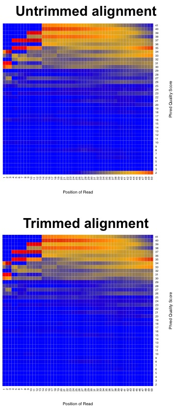
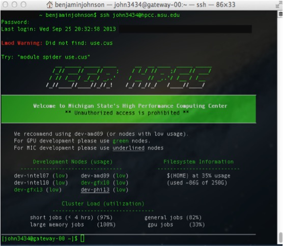

.. _daytwo:

RNA-seq background information, basic Linux/Unix commands, Trimmomatic, and FastQC
==================================================================================

Before we dig into the data and begin trimming and aligning the reads to the genome, I think it is useful to understand what happens *after you submit your RNA to the sequencing facility*. This sort of knowledge can be very useful in understanding what could potentially provide bias and any number of issues to the end dataset. In this session we will cover several things including: 

#. :ref:`rnaseqbackground`

#. :ref:`basic-unix-coms`

#. :ref:`gettingdata`

#. :ref:`dtwotrim`

#. :ref:`dtwofqc`

.. _rnaseqbackground:

RNA-seq background information
------------------------------

Before we begin, let's watch a video about how `Illumina sequencing works <https://www.youtube.com/watch?v=womKfikWlxM>`_.

This video does a pretty good job explaining how, in generalities the sequencing process works for DNA. So for sequencing RNA, the process is as follows:

.. image:: rnaseqworkflow.jpg
	:align: center
	:alt: RNAseq workflow
	
*Adapted from: Zhernakova et al., PLoS Genetics 2013*

So actually, we aren't sequencing RNA at all! We are sequencing the cDNA made from the RNA. RNA-seq is a high resolution next generation sequencing (NGS) method to assess the transcriptome of an organism and compare transcriptional changes between organisms/treatments to ascertain specific pathways/genes that are moving in response. But now, let's talk about what can add bias to the data and what we do with the data to make sure that it is reasonable to proceed to further analysis steps.

But first, let's brainstorm a little bit. Look back at the RNA-seq workflow figure above and let's suggest a few places where things could potentially affect the output dataset.

Here are a few thoughts...

	* How could the random priming step affect downstream results?
	* How could RNA secondary structures affect the library preparation process?
	* Would GC content be a problem?
	* Could gene length cause issues?
	* What might happen if you have genes with substantially different expression levels?
	* During the cluster generation on the Illumina flow cell, what might happen if you have too few clusters? Too many?
	* How is it possible to sequence many samples at one time?
	* What if you run out of reagents from one kit and have to open another kit to finish the library preparation process?
	* Could sequencing depth be an issue?
	
So now that you may be questioning the validity of any RNA-seq dataset, take heart! Many very smart people have thought about these issues and come up with ways to assess technical artifacts and correct for them. So again, let's brainstorm some potential solutions to these problems. Which problems can be addressed through better chemistries/processes vs. mathematical/computational correction?

These sorts of issues should always be considered, but recognize that RNA-seq is becoming fairly commonplace and solutions to many of these questions exist. Be critical of your data and *always* look at the raw data.

Multiplexing the sequencing process by pooling several samples together is not only cheaper, it can overcome what are known as *batch effects*. Batch effects are when you have samples that correlate with one another based on batch/time/etc. instead of biological replication. This is a very real phenomenon and can be caused by using different lots of the same kit/flow cells when preparing samples! You can correct for this, but we will get there later... For now, have a look at the diagram showing how multiplexing is achieved.

.. image:: multiplex.jpg
	:align: center
	:alt: Multiplexing samples diagram
*From: http://www.illumina.com/content/dam/illumina-marketing/documents/products/sequencing_introduction_microbiology.pdf*

This is an example of what a *batch effect* looks like. Note how DMSO1 and ETZ1 group together and DMSO2 and ETZ2 group together (e.g. by batch).

We can determine what is considered a "good" base call from a "bad" one through using what is known as the Phred scoring system or Q-score.

Where Q is defined as a property that is logarithmically related to the base call error probability:

.. math::

	Q = -10 \log_{10} P\ |\ error\ probability = P^2
	
So this means:

.. image:: basecall.jpg
	:align: center
	:alt: Phred scoring table

*From: http://res.illumina.com/documents/products/technotes/technote_q-scores.pdf*

Illumina tends to output sequence results with a Q > 30. So let's have a look at what some raw data looks like in terms of Q-scores before and after trimming adapters and low quality reads.

	
This is why we do the trimming before attempting to align the reads to the reference genome. Since we are using FastQC, let's have a look at some sample data of what `good Illumina data looks like <http://www.bioinformatics.babraham.ac.uk/projects/fastqc/good_sequence_short_fastqc.html>`_.

So, we have come to the end of the background section. Even with all of the great tools and chemistries that have been developed to handle RNA-seq datasets, the old mantra still applies: *garbage in; garbage out* and *with great power comes great responsibility*. Take care in analyzing these sorts of data as they typically influence many downstream experiments.

**Questions!**

.. _basic-unix-coms:

Basic Linux/Unix commands
-------------------------

To refresh your memory on some basic Linux/Unix commands, we will cover the basic commands necessary to:

**1.** Move through folders

**2.** List the contents of a folder

**3.** Make new folders

**4.** Rename files/folders

**5.** Delete files/folders

**6.** Load modules on the MSU HPCC

.. csv-table::
   :header: " ", "Command", "What it does...", "Examples"
   :widths: 2, 8, 10, 40

   "**1.**", "cd", "Change directory/folder", "**>** cd ~ (this changes to your home directory); **>** cd .. (this goes back one folder)"
   "**2.**", "ls", "List the contents of a folder", "**>** ls"
   "**3.**", "mkdir", "Make a new directory/folder", "**>** mkdir NewFolder (this will make a new folder called 'NewFolder' in your current directory)"
   "**4.**", "mv", "Rename or move a file from one name to another", "**>** mv file1 file2 (this will rename/move file1 to file2)"  
   "**5.**", "rm", "Remove a file (add the -r flag to remove a folder)", "**>** rm file1 (remove file1); **>** rm -r folder1 (remove folder1)" 
   "**6.**", "module load", "Load a module on the MSU HPCC", "**>** module load Bowtie (loads the most recent version of Bowtie on the HPCC)"

**Command reference sheet**

.. image:: linuxcoms.jpg
	:align: center
	:alt: Linux/Unix command list
	
*Ref. sheet from: http://files.fosswire.com/2007/08/fwunixref.pdf*

.. _gettingdata:

Getting some RNA-seq data
-------------------------

Before we begin, we need to collect some RNA-seq data to work with! To do this, we are going to take the first 100,000 sequences from a study looking at how *M. tuberculosis* changes its metabolism in response to different carbon sources at neutral and acidic pH (`Baker et al. <http://onlinelibrary.wiley.com/doi/10.1111/mmi.12688/abstract;jsessionid=BD049DD06022112AB9F13CF587989C0A.f02t03>`_).

To do this, let's log onto the HPCC. 

**Logging into the MSU HPCC**

There are multiple ways with which you can access the HPCC and transfer files to the iCER machines. This overview will be from a GUI standpoint. If you would like to get fancy and learn the Linux/Unix commands, you can access the examples on the HPCC wiki `here <https://wiki.hpcc.msu.edu/display/hpccdocs/Transferring+Files+to+the+HPCC>`_. Any other questions you may have not detailed here (which is a lot...) on how to use the HPCC more effectively, you can check out the user manual `here <https://wiki.hpcc.msu.edu/display/hpccdocs/HPCC+Basics>`_. There are even videos of examples on how to use various software packages.

**Mac users:**

**1.** Open the terminal by going to Finder -> Applications -> Utilities -> Terminal (might just be worth dragging it onto your dock).

.. image:: mactermnav.jpg
	:align: center
	:alt: Navigate to terminal on a Mac

**2.** Type: **ssh YourMSUNetID@hpcc.msu.edu**

**3.** You will then be prompted for your MSU NetID password. As you begin to type, the cursor will not show that you are entering characters, but you are. Hit the Enter/Return key at the end and you will be logged in. If this is the first time accessing the HPCC, it will send you a warning about not recognizing the RSA fingerprint. Type **yes** or **y** or whatever it needs to continue. It is okay, and necessary, to say you trust iCER to use the HPCC at MSU. If you are uncomfortable with any of this, utilize a lab or MSU computer.

**4.** As an example of **Step 3.**, for me it would be **> ssh john3434@hpcc.msu.edu**.

**5.** Once you are logged in, it should look something like this:

	
**6.** Congratulations! You've logged in. Let's make a new folder here in anticipation of putting the data into it. Let's call it **RNAseq**. Please don't add any spaces. If you aren't sure how to make a new folder, scroll up a bit to the :ref:`basic-unix-coms`.

**7.** To **log out**, type: **exit**.

**Windows users:** 

**1.** I am going to take the easy way out and `here <https://wiki.hpcc.msu.edu/display/hpccdocs/Video+Tutorial+-+Putty>`_ is a video on how to install an ssh client on Windows.

**2.** Congratulations! You've logged in. Let's make a new folder here in anticipation of putting the data into it. Let's call it **RNAseq**. Please don't add any spaces. If you aren't sure how to make a new folder, scroll up a bit to the :ref:`basic-unix-coms`.

**3.** To **log out**, type: **exit**.

Great! Now that we are logged onto the HPCC and created the RNAseq folder, let's grab the data. To do this, copy and paste these commands into your terminal and then hit Enter/Return (Mac users can use Command+C to copy and paste; Windows (PuTTY) users can use Ctrl+C to copy and then right mouse click to paste into the terminal::

    module load powertools
    intel14
    cd ~/RNAseq
    mkdir Data QC Bowtie HTSeq
    cd Data
    cp /mnt/research/mmg434/ExampleRNAseqData/*.fq.gz .
    ls
    
So we have grabbed data from 4 different conditions (done in biological duplicate):

**1.** Glycerol pH 7.0

**2.** Glycerol pH 5.7

**3.** Pyruvate pH 7.0

**4.** Pyruvate pH 5.7

Thus, in total, we have 8 different libraries. However, before we move on, let's have a look at the commands we just entered. This is important to think about as the next time we will be working with RNA-seq data, it will be with the samples that you submitted for *L. reuteri*. Data management during the analysis is critical! Please be organized when doing analysis with large datasets. This will make your life much, MUCH easier when you have to come back later and sort out what is where and at what point in the analysis you are.
So, let's break down these commands:

**1.** module load powertools - This command loads a series of commands that we can utilize to work on the HPCC in a fashion that makes our lives much easier.

**2.** intel14 - This is a powertools command that logs us into the intel14 compute node on the HPCC.

**3.** cd ~/RNAseq - This command changes directory/folder to our RNAseq directory/folder we made earlier.

**4.** mkdir Data QC Bowtie HTseq - This command creates some directories/folders within the RNAseq directory/folder with which to put all of our data. This allows us to keep each portion of the analysis in reasonably defined places.

**5.** cd Data - Change directory/folder to Data.

**6.** cp /mnt/research/mmg434/ExampleRNAseqData/*.fq.gz . - This command copies the data from the /mnt/research/mmg434/ExampleRNAseqData directory/folder to the directory/folder that you are currently in.

**7.** ls - This command lists the contents of the directory/folder you are currently in.

Now we can move on to trimming the data!

.. _dtwotrim:

Trimmomatic
-----------

Trimmomatic is a lightweight java application that can remove Illumina adapter sequences and low quality reads. It uses a sliding window to analyze chunks of each read, examining the quality score, minimum read length, if it corresponds to an adapter sequence, etc. Let's have a look at the `documentation <http://www.usadellab.org/cms/index.php?page=trimmomatic>`_ to see what each option does.

We are going to trim the first file: gly7a.fq.gz. Later we will automate all of the trimming with a script, which we will look at the script below, but for now, let's trim the first file! Copy and paste these commands into your terminal and hit Enter/Return::

    module load trimmomatic
    java -jar $TRIM/trimmomatic SE -threads 4 ~/RNAseq/Data/gly7a.fq.gz ~/RNAseq/QC/trimmedgly7a.fq.gz ILLUMINACLIP:$TRIM/adapters/TruSeq3-SE.fa:2:30:10 LEADING:3 TRAILING:3 SLIDINGWINDOW:4:15 MINLEN:36
    
You will likely see some output that looks like this::

    TrimmomaticSE: Started with arguments: -threads 4 /mnt/home/john3434/RNAseq/Data/gly7a.fq.gz /mnt/home/john3434/RNAseq/QC/trimmedgly7a.fq.gz ILLUMINACLIP:/opt/software/Trimmomatic/0.32/adapters/TruSeq3-SE.fa:2:30:10 LEADING:3 TRAILING:3 SLIDINGWINDOW:4:15 MINLEN:36
    Using Long Clipping Sequence: 'AGATCGGAAGAGCGTCGTGTAGGGAAAGAGTGTA'
    Using Long Clipping Sequence: 'AGATCGGAAGAGCACACGTCTGAACTCCAGTCAC'
    ILLUMINACLIP: Using 0 prefix pairs, 2 forward/reverse sequences, 0 forward only sequences, 0 reverse only sequences
    Quality encoding detected as phred33
    Input Reads: 100000 Surviving: 96867 (96.87%) Dropped: 3133 (3.13%)
    TrimmomaticSE: Completed successfully

.. note:: Copy this output into a text file somewhere and save it. You might want this for a report when you're finished.

Congratulations! You've just trimmed the first file of RNA-seq data! But, let's remind ourselves what each command and parameter is doing. Look through the command and discuss with a neighbor what is going on there. If you don't remember what each parameter does, have another look at the `documentation <http://www.usadellab.org/cms/index.php?page=trimmomatic>`_.

Now, beyond what Trimmomatic requires for input, we are doing one fancy thing here when we specify where the software file is and where the adapter file is with the **$TRIM**. This is specific for the MSU HPCC and is simply a shortcut that represents a file path.

Go ahead and work with a neighbor and see if you can trim the second data file: gly7b.fq.gz. Take 5 minutes and give it a shot!

**Have fun! Let me know if you have questions by placing a red sticky note on your computer.**

.. _dtwofqc:

FastQC
------

FastQC is a piece of software that allows us to analyze the quality of our data before proceeding to aligning the reads to the reference genome. Let's have a look again at what `good Illumina data <http://www.bioinformatics.babraham.ac.uk/projects/fastqc/good_sequence_short_fastqc.html>`_ and `bad Illumina data <http://www.bioinformatics.babraham.ac.uk/projects/fastqc/bad_sequence_fastqc.html>`_ look like. This will help us determine the quality of our own sequence based on their examples.

Let's analyze the first file (trimmedgly7a.fq.gz) that we trimmed! To run FastQC on the HPCC, copy and paste the following commands into your terminal::

    module load fastqc
    cd ~/RNAseq/QC
    fastqc trimmedgly7a.fq.gz
    
You will see some output that looks like this::

    Started analysis of trimmedgly7a.fq.gz
	Approx 5% complete for trimmedgly7a.fq.gz
	Approx 10% complete for trimmedgly7a.fq.gz
	Approx 15% complete for trimmedgly7a.fq.gz
	Approx 20% complete for trimmedgly7a.fq.gz
	Approx 25% complete for trimmedgly7a.fq.gz
	Approx 30% complete for trimmedgly7a.fq.gz
	Approx 35% complete for trimmedgly7a.fq.gz
	Approx 40% complete for trimmedgly7a.fq.gz
	Approx 45% complete for trimmedgly7a.fq.gz
	Approx 50% complete for trimmedgly7a.fq.gz
	Approx 55% complete for trimmedgly7a.fq.gz
	Approx 60% complete for trimmedgly7a.fq.gz
	Approx 65% complete for trimmedgly7a.fq.gz
	Approx 70% complete for trimmedgly7a.fq.gz
	Approx 75% complete for trimmedgly7a.fq.gz
	Approx 80% complete for trimmedgly7a.fq.gz
	Approx 85% complete for trimmedgly7a.fq.gz
	Approx 90% complete for trimmedgly7a.fq.gz
	Approx 95% complete for trimmedgly7a.fq.gz
	Analysis complete for trimmedgly7a.fq.gz
	
Now, to view the report, please use either FileZilla or WinSCP to transfer the file: **trimmedgly7a_fastqc.html** onto your desktop. If you don't remember how to use FileZilla, check back to :doc:`dayonemod`.

Let's open the file in a browser like FireFox. What do we think? Good or bad data?

Please work with a neighbor and perform FastQC analysis on the next file (trimmedgly7b.fq.gz). Give it a shot and put a green sticky note on your computer once you have done this and viewed the result in a browser.

Automating all of this
----------------------

This was fine to just do two samples, but it sure does take a lot of time to do each one individually! Let's have a look at a script that will do all the trimming and FastQC analysis for us in one shot.

Have a look at the script below:

.. literalinclude:: qctrimming.sh

Let's run it! Copy and paste the command into your terminal and hit Enter/Return::

    bash /mnt/research/mmg434/RNAseqScripts/qcexampledata.sh
    
That's it! It has done everything for you at one time! This is also nice if we want to go back and re-run this analysis again, which will produce the same results each time.

**Presentation time!**

Please have one person from each treatment group come and present a *representative* report from each treatment, assessing the results.

.. note:: Save your report so that we can compile them at the end of the module.